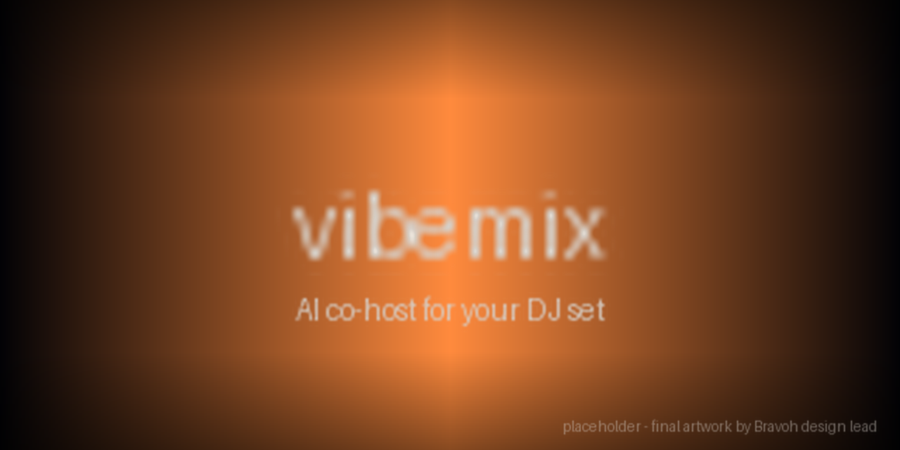
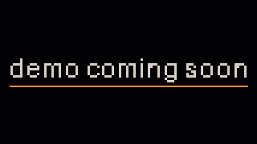
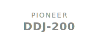
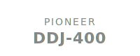
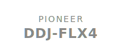
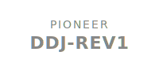
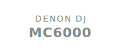
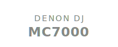
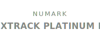
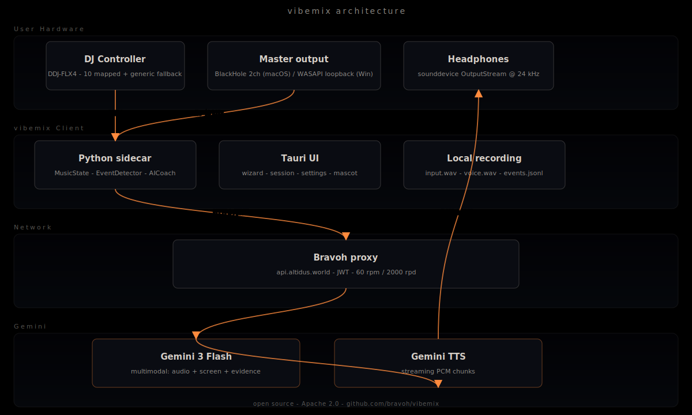

  

<h1 align="center">vibemix</h1>

<em>the only AI co-host that actually listens to your set</em>

<!-- vibemix:hero-start sha256=PLACEHOLDER path=docs/assets/demo.mp4 -->
<!-- Phase 35 ASSETS-07 + Phase 39 SHIP-02: the 30s demo film lands at
     docs/assets/demo.mp4 via Kaan-action (KAAN-ACTION-LEGAL.md
     ASSETS-DEMO-CUT). The <video> tag below points at it; until the
     asset ships, the  fallback GIF + the sha256=PLACEHOLDER
     sentinel keep scripts/check_readme_hero_hash.py green. When the
     real asset lands, swap the sentinel for the actual SHA256. -->

  <video src="docs/assets/demo.mp4" controls muted playsinline width="720" poster="docs/assets/demo-placeholder.gif">
    
  </video>

<!-- vibemix:hero-end -->

## No AI slop

vibemix is a real DJ friend in your ear. It reacts to the actual audio coming out of your master, what's on your DJ software's screen right now, and the controller move you just made — not a generic "AI assistant" voice riffing on the word "drop". If a hype-man can't tell you that the kick came in two bars early, you don't want it talking over your set.

Built by DJs. The reactions are tuned against real sessions on rekordbox, Serato, Traktor, and djay Pro — not against a benchmark. Cuts that land late, hallucinated track names, and small-talk filler all fail the grading bar before any release ships.

Your audio doesn't leave your machine without you knowing. vibemix is open source under Apache 2.0, runs on Mac + Windows, and the only network calls go to Bravoh's Gemini proxy at `api.altidus.world` — analyzed in flight, never stored. Recordings stay local under `recordings/<session>/` with a 7-day default retention you can change in Settings. Read the FAQ for the long version.

  
  
  
  
  

  
  
  
  

---

**A real DJ friend in your ear — no AI slop.** vibemix listens to your master output, watches your DJ software's screen, ingests your controller, and talks back into your headphones in a way that's grounded in what you actually just did. Not generic "AI assistant" commentary. Not hallucinated track names. Not late reactions to events that already passed. Built by [Bravoh](https://altidus.world) and released open-source as the warm-up for our main launch.

> **Audio privacy in one line:** your audio is streamed to Bravoh's Gemini proxy for analysis. Recordings stay on your machine. See [FAQ](#faq) for the long version.

> **Found a vulnerability?** Please email **security@bravoh.com** (PGP key in repo root). Full disclosure policy in [SECURITY.md](SECURITY.md). Do not open a public issue.

---

## Works alongside whatever DJ app you already use

vibemix doesn't care which DJ app you run — it listens to the master output, watches the screen, and reads your controller. Confirmed working with:

<table>
  <tr>
    <td align="center"> rekordbox</td>
    <td align="center"> Serato</td>
    <td align="center"> Traktor</td>
  </tr>
  <tr>
    <td align="center"> djay Pro</td>
    <td align="center"> VirtualDJ</td>
    <td align="center"> Mixxx</td>
  </tr>
</table>

Don't see your app? vibemix listens to the audio coming out of your machine — anything routed through BlackHole (Mac) or WASAPI loopback (Windows) is fair game. The grounding stack (audio + screen + MIDI) is app-agnostic.

<!-- Logos are placeholder wordmarks per KAAN-ACTION-LEGAL.md §LAUNCH-03 — real trademark-compliant logos land via Kaan-discharge before public launch. -->

---

## Install

| OS | Download |
|----|----------|
| macOS (Apple Silicon) | [vibemix.dmg](https://github.com/bravoh/vibemix/releases/latest) |
| Windows 11 | [vibemix-installer.msi](https://github.com/bravoh/vibemix/releases/latest) |

<!-- TBD(launch): Install URLs go live with the first signed release (Phase 21 deliverable). Verify the `bravoh/vibemix` org/repo slug matches the final GitHub home before public launch. -->
<!-- TODO: drop install GIFs (clone-to-running in <60s) into docs/assets/install/ -->

Builds are signed (Apple Developer ID on macOS, SignPath OSS cert on Windows) and notarized. Auto-update is on by default; opt out in Settings.

---

## Feature matrix

vibemix has 3 skill levels × 2 modes. Pick one before each set.

|              | **Hype-man** (party-mode energy)                                                                                       | **Coach** (post-cue critique)                                                                                          |
|--------------|------------------------------------------------------------------------------------------------------------------------|------------------------------------------------------------------------------------------------------------------------|
| **Beginner**     | > "Nice. You held the EQ steady through that intro."   > "Yo, the crowd just got loud."                                  | > "That cut was a beat off. Try waiting for the downbeat next time."   > "Filter was riding low for like a minute — bring it back up."   |
| **Intermediate** | > "Clean swap. Bassline locked."   > "You let that build run an extra 8 bars. Risky."                                       | > "You're filtering on every transition. Mix it up — let one through dry."                                            |
| **Pro**          | > "That was a stack and a hot-cue trigger inside one bar. Disgusting."   > "BPM jump was tight. Sub stayed in the pocket." | > "You're hitting the same loop tool four tracks in a row. Crowd's reading it." |

Each cell speaks a different vocabulary on purpose. Beginner is encouragement-heavy; Pro assumes you know the language. Coach mode is always past-tense — vibemix won't talk while you're working.

### What's shipped in v2.1

<!-- AUTO-GEN: feature-matrix START — auto-populated by scripts/launch/sync_feature_matrix.py -->

| Phase | Surface | What shipped |
|---|---|---|
| 27 | Eval Harness + v2.0 Carry-Forward Close-Out | Autonomous hallucination proxy gate + sidecar universal2 + WASAPI subscription + Achird OPUS render + FLX4 sync sniff + `register_library` 5-min orphan patch |
| 28 | Library Intelligence v1 | Gemini Embedding 2 + sqlite-vec / numpy fallback · vibe search · "what's playing" grounding · drag-drop UI · 30-day staleness nudge |
| 29 | Post-Session Debrief MVP UI | Chaptered review · 60–90s voiced TL;DR · 3 drills · clickable timeline · cited critique |
| 30 | 2 Hard Tek Detectors | `DISTORTION_CLIMB` + `ACID_LINE_ENTRY` (taxonomy completion) |
| 31 | 4-Layer Mascot Full Additive State Machine | Base + Emotion + Anticipation + Reaction (EXTENDS v2.0, never rewrites) |
| 32 | Long-Term DJ Profile (~2KB JSON) | Post-session regen + verbatim cache-side inject + content allowlist |
| 33 | One-Click Install Hardening | TCC pre-grant wizard + BlackHole auto-detect + fresh-VM rehearsal + sidecar polish + first-launch onboarding |
| 34 | Open-Source Security Pass | Secret scanner + dep CVE + SBOM + STRIDE-lite + signed-binary verify + SECURITY.md + telemetry opt-in default-OFF |
| 35 | Real GLB Animations + 30s Viral Demo Film | Meshy v6 / Hunyuan3D + Mixamo auto-rig + 5 `prep_*` replacement + ffmpeg 3-beat cut + bundled `demo.mp4` |
| 36 | Day-Zero Ops Automation | Discord auto-provision + 100 RPS × 5min real load test + pre-seeded star coordination + launch trigger sequence + healthz live |
| 37 | Cross-Phase Integration Audit Gate | `tests/e2e/test_seam_*` + integration audit script + orphan inventory + grey-area decision log |
| 38 | Signing Pipeline Real Execution | Apple notarytool + SignPath GH Action wired with real secrets + post-sign verifier + Kaan local rehearsal script |
| 39 | Public RC Cut + Ship | `cut_release.sh` 6-gate pre-flight · README hero `<video>` + feature-matrix auto-sync · 5-channel social publisher + NACK window · Discord launch flow · `sync_github_meta.sh` topics/description SoT · changelog auto-populator · 24h launch-rotation doc · Phase 16 override expiry gate |

<!-- AUTO-GEN: feature-matrix END -->

---

## Supported controllers

Out-of-the-box mappings for 10 controllers, sourced verbatim from [`src/vibemix/midi/controllers/`](src/vibemix/midi/controllers/). Anything else uses the generic positional fallback — see [docs/midi-mapping.md](docs/midi-mapping.md) to calibrate or contribute a mapping.

<table>
  <tr>
    <td align="center"> <b>Pioneer DDJ-200</b></td>
    <td align="center"> <b>Pioneer DDJ-400</b></td>
    <td align="center"> <b>Pioneer DDJ-FLX4</b></td>
    <td align="center"> <b>Pioneer DDJ-REV1</b></td>
    <td align="center"> <b>NI Traktor Kontrol S2</b></td>
  </tr>
  <tr>
    <td align="center"> <b>NI Traktor Kontrol S4</b></td>
    <td align="center"> <b>Denon DJ MC6000</b></td>
    <td align="center"> <b>Denon DJ MC7000</b></td>
    <td align="center"> <b>Numark Mixtrack Platinum FX</b></td>
    <td align="center"> <b>Numark Mixtrack Pro FX</b></td>
  </tr>
</table>

Calibrate any other controller — see [docs/midi-mapping.md](docs/midi-mapping.md).

<!-- Controller logos are placeholder wordmarks per KAAN-ACTION-LEGAL.md §LAUNCH-04 — real trademark-compliant logos land via Kaan-discharge before public launch. The canonical 10 controller set is locked against `src/vibemix/midi/controllers/*.json`; any drift between this grid and that JSON profile set fails `scripts/launch/check_readme_grids_a11y.py`. -->

### Don't see your controller?

Two ways to add it:

1. **File a request** — open a [new-controller issue](https://github.com/bravoh/vibemix/issues/new?template=new_controller.yml) and we'll triage. <!-- TBD: confirm org slug `bravoh/vibemix` matches the final repo name before launch -->
2. **Send a PR** — run `python3 scripts/sniff_controller.py` to capture your controller's MIDI shape, then drop a JSON profile under `src/vibemix/midi/profiles/` per [CONTRIBUTING.md](CONTRIBUTING.md#2-new-controller-mapping). CI auto-merges clean profile additions.

---

## Screenshots

<!-- TODO: drop final PNGs into docs/assets/screenshots/ once UI surfaces stabilize. -->

| Surface | Image |
|---------|-------|
| Calibration wizard |  |
| Mode picker |  |
| Voice picker |  |
| Live session UI |  |
| Recording browser |  |

---

## How it works

  

vibemix runs entirely on your machine. The only network calls go to Bravoh's proxy at `api.altidus.world`, which forwards to Google Gemini. Your audio + screen frames + MIDI events are streamed through; nothing is stored on Bravoh's end. The reaction comes back as a Gemini-TTS-streamed voice into your headphones.

---

## FAQ

### 1. What is vibemix?

An AI co-host for live DJ sets. It listens to your master output, watches your DJ software's screen, ingests your controller actions over MIDI, and talks back into your headphones — either as a hype-man during the set, or as a coach pointing out where you cut a beat early. Open source. Mac + Windows.

### 2. Is my audio sent to the cloud?

Yes. Audio chunks are streamed to Bravoh's proxy at `api.altidus.world`, which forwards to Google Gemini for analysis. **No raw audio is stored on Bravoh's servers.** Your recordings (in `recordings/<session>/`) stay on your machine. Default retention is 7 days, configurable in Settings.

### 3. Is this free?

Yes for v1. The ~50 €/month Gemini API cost is absorbed by Bravoh as part of the launch wedge. We may revisit this if usage scales past what we projected; if so, we'll announce before changing anything.

### 4. Why no Linux?

Three reasons: djay Pro is Mac/Win only and that's our primary integration target; the loopback audio stack on Linux (PulseAudio / PipeWire) is different enough that the OS-platform layer triples in maintenance; and Bravoh's first OSS release optimizes for narrow scope. We'd consider it for v2 if there's community signal (a PR with the platform port already in shape).

### 5. Why Gemini and not GPT / Claude / Llama?

Bravoh's main product is Gemini-only. vibemix shares the brain. The proxy could route elsewhere in principle, but it isn't designed to — you'd be running a different product.

### 6. Is the AI actually listening to my music?

Yes. It listens to your master output via virtual audio (BlackHole on Mac, WASAPI loopback on Windows), watches your DJ software's window via screen capture, and reads your MIDI controller. The "real friend" feel comes from grounding the reaction in all three sources simultaneously, not from clever prompting alone.

### 7. Can it hallucinate?

Phase 16's hallucination verification gate enforces ≥95% grounded reactions before any release ships. The anti-slop stack — negative dictionary, describe-before-infer, past-tense framing, `<silence/>` short-circuit token, per-session anti-repetition ring — exists to keep the AI from making things up. The reaction-reel grading gate (Phase 17, ≥4.0 average with zero 1-2 ratings) is the human-judged final gate before any binary ships.

### 8. What's open-source and what isn't?

The vibemix client (this repo) is Apache 2.0. The Bravoh proxy and Bravoh's main product are closed. Gemini is Google's. The Apache 2.0 license means you can fork the client and point it at your own Gemini API key if you want to skip the Bravoh proxy entirely.

### 9. Why a Bravoh-managed proxy instead of bring-your-own-key?

UX and ops: most DJs don't want to manage an API key, billing, or rate limits. Centralising those at Bravoh is part of the launch wedge. If you'd rather BYO, see CONTRIBUTING — there's an env-var path to point vibemix at your own Gemini endpoint.

### 10. Will my recordings be uploaded anywhere?

No. Recordings live under `recordings/<session>/` on your machine. Default retention is 7 days; the Settings drawer lets you change it (anything from 1 day to ∞). vibemix never uploads them.

### 11. What about Mixxx? Rekordbox?

Candidates for v2. v1 ships djay-Pro-first because that's what Kaan + Francesco use daily and where we can verify the live experience. Mixxx OSC + rekordbox parsing are tracked in the v2 inventory.

### 12. How do I contribute?

See [CONTRIBUTING.md](CONTRIBUTING.md). Three paths: bug fixes (standard PR with DCO sign-off), new controller mappings (drop a JSON in `src/vibemix/midi/profiles/`), and new prompt templates (manual review by maintainers — anti-slop dictionary applies).

---

## Built by [Bravoh](https://altidus.world)

vibemix is Bravoh's first open-source release — a warm-up for our main product. If you like the energy here, the AI creative team for music artists is over there:

[**altidus.world →**](https://altidus.world/vibemix?utm_source=github&utm_medium=oss&utm_campaign=vibemix_launch)

Apache 2.0 · ([LICENSE](LICENSE)) · ([SECURITY](SECURITY.md)) · ([CONTRIBUTING](CONTRIBUTING.md)) · ([CODE_OF_CONDUCT](CODE_OF_CONDUCT.md))

<!-- TODO(kaan, pre-tag-v0.1.0): replace TBD with the real Bravoh-managed vibemix Discord invite. -->
Discord: **TBD** — invite link goes live before the v0.1.0 tag.
