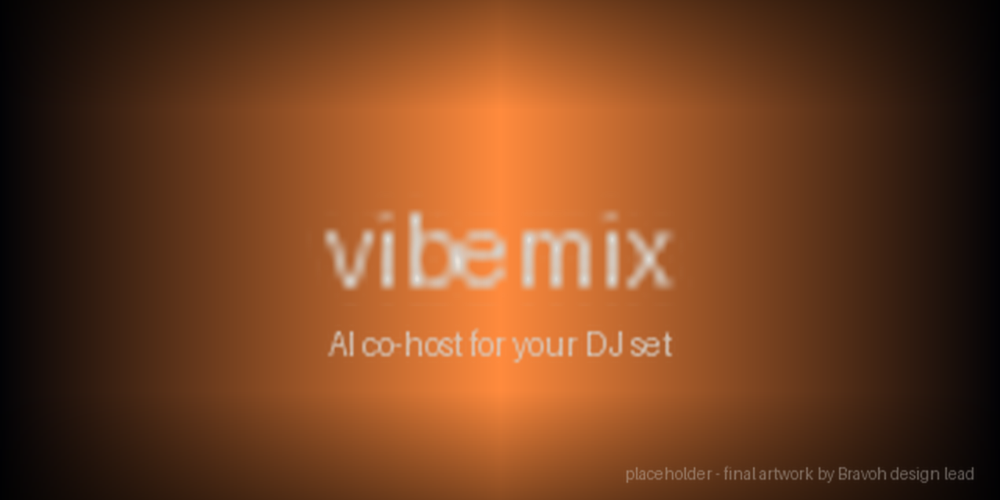
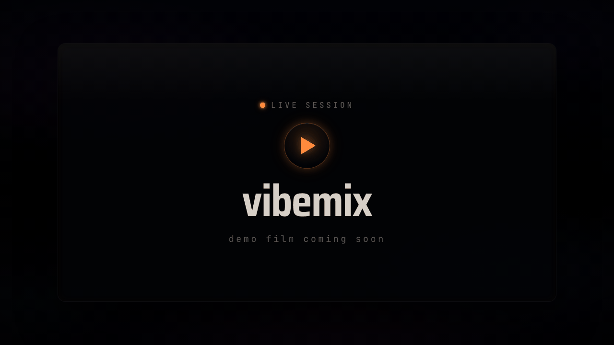
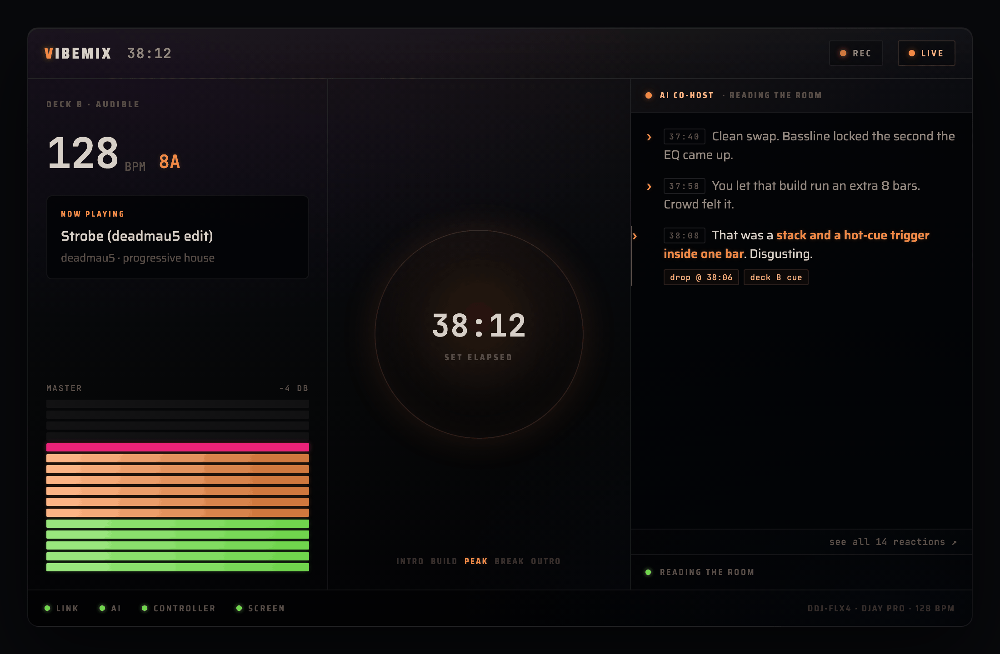
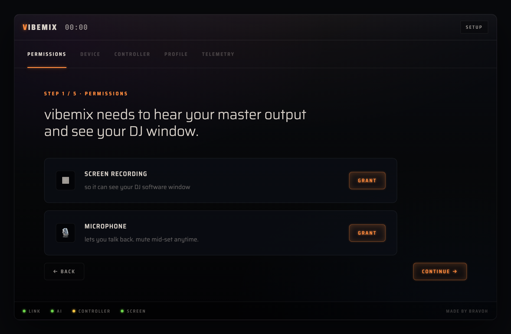
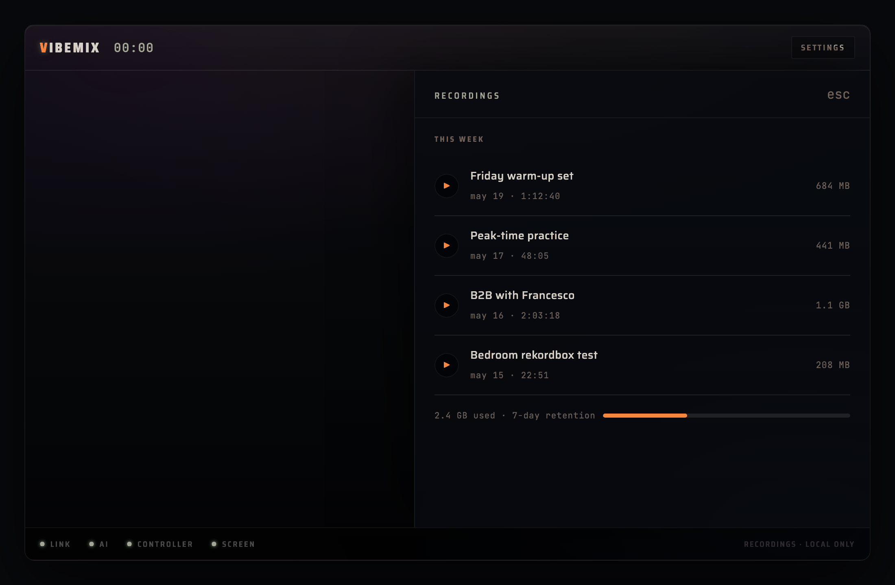
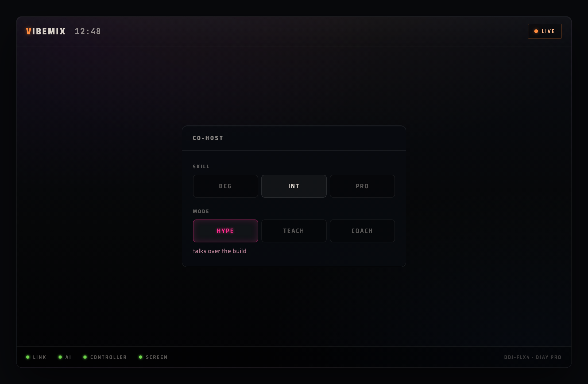
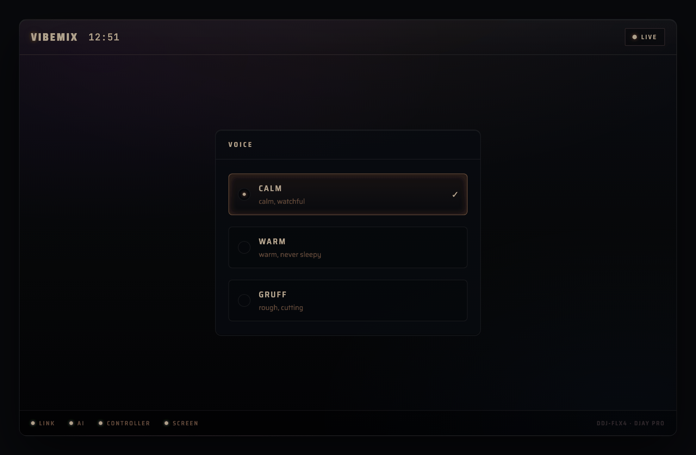
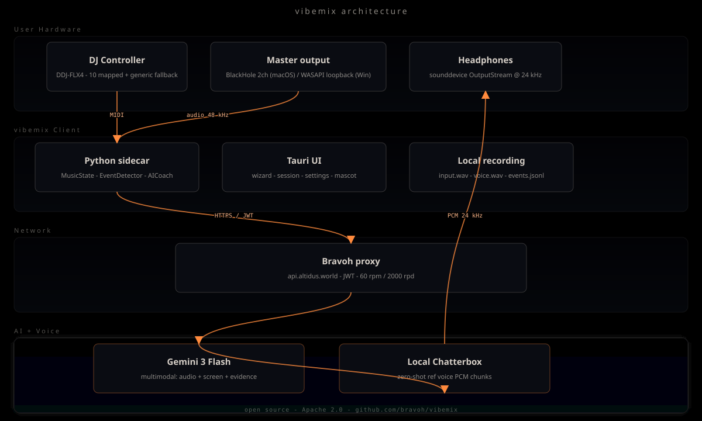

  

<h1 align="center">vibemix</h1>

<em>the only AI co-host that actually listens to your set</em>

<!-- vibemix:hero-start sha256=PLACEHOLDER path=docs/assets/demo.mp4 -->
<!-- The 30s demo film lands at docs/assets/demo.mp4 (Kaan-action). Until it ships,
     the poster below carries the visual and keeps the link non-broken.
     Planned markup once the asset lands: <video src="docs/assets/demo.mp4"
     poster="docs/assets/demo-poster.png" controls>. The sha256=PLACEHOLDER
     sentinel keeps scripts/check_readme_hero_hash.py green until then. -->

  

<!-- vibemix:hero-end -->

## No AI slop

vibemix is a real DJ friend in your ear. It reacts to the audio coming out of your master, what is on your DJ software's screen right now, and the controller move you just made. Not a generic assistant voice riffing on the word "drop". If a co-host cannot tell you the kick came in two bars early, you do not want it talking over your set.

Every spoken line cites a real detected event or it gets stripped before you hear it. Built by DJs: cuts that land late, hallucinated track names, and small-talk filler fail the grading bar before any release ships. The bar is "real friend who knows your set", not "voice assistant doing music commentary".

Your audio doesn't leave your machine without you knowing. The vibemix client is Apache-licensed; the hosted Bravoh service and Bravoh's product services are managed commercial infrastructure. Live co-host calls go to Bravoh's hosted service, analyzed in flight and never stored. Library search runs locally with on-device CLAP embeddings (a one-time model download on first Library open; the live co-host works without it). Recordings stay under `recordings/<session>/` with a 7-day default retention you set in Settings.

  
  
  
  
  

  
  
  

---

vibemix listens to your master output, watches your DJ software's screen, ingests your controller, and talks back into your headphones, grounded in what you just did. Built by [Bravoh](https://bravoh.ai) as a commercial product with an Apache-licensed client.

> **Audio privacy in one line:** live audio is streamed to Bravoh's hosted service for analysis; library search stays local; recordings stay on your machine. See the [FAQ](#faq) for the long version.

> **Found a vulnerability?** Email **security@bravoh.ai** (PGP key in repo root). Full policy in [SECURITY.md](SECURITY.md). Do not open a public issue.

---

## Works alongside whatever DJ app you already use

vibemix grounds on the audio and the controller, so the app you run is your call. The audio and MIDI grounding work app-agnostic; on-screen reading expands per app. The grid below is the live-test target list, with rekordbox and the DDJ-FLX4 as the daily-verified path and the rest expanding as DJs sign off.

<table>
  <tr>
    <td align="center"> rekordbox</td>
    <td align="center"> Serato</td>
    <td align="center"> Traktor</td>
  </tr>
  <tr>
    <td align="center"> djay Pro</td>
    <td align="center"> VirtualDJ</td>
    <td align="center"> Mixxx</td>
  </tr>
</table>

Don't see your app? vibemix listens to the audio coming out of your machine, so anything routed through BlackHole on Mac is fair game. The grounding stack (audio plus MIDI) does not care which app produced the sound.

<!-- Logos are placeholder wordmarks; real trademark-compliant logos land before public launch. -->

---

## Install

| OS | Download |
|----|----------|
| macOS (Apple Silicon) | [vibemix.dmg](https://github.com/bravoh-ai/vibemix/releases/latest) |
| Windows 11 | v1.1 fast-follow (GPU voice backend + signing path in flight) |

<!-- Launch note: install URLs go live with the first signed release. Install GIFs land in docs/assets/install/ with that cut. -->

**v1 ships macOS Apple Silicon first.** Public distribution is gated on producing and verifying a fresh signed and notarized DMG. Windows is the v1.1 fast-follow: the co-host voice runs on Apple Silicon via Metal, so the Windows build waits on its own GPU voice backend and signing path. Auto-update is on by default for release builds; opt out in Settings.

macOS builds use Apple Developer ID plus notarization. See the [Code Signing Policy](docs/code-signing-policy.md) and the [Privacy Policy](PRIVACY.md) for the details.

---

## Two modes, three skill levels

Pick one before each set.

|              | **Hype-man** (party-mode energy)                                                                                       | **Coach** (post-cue critique)                                                                                          |
|--------------|------------------------------------------------------------------------------------------------------------------------|------------------------------------------------------------------------------------------------------------------------|
| **Beginner**     | > "Nice. You held the EQ steady through that intro."   > "Yo, the crowd just got loud."                                  | > "That cut was a beat off. Wait for the downbeat next time."   > "Filter rode low for about a minute. Bring it back up."   |
| **Intermediate** | > "Clean swap. Bassline locked."   > "You let that build run an extra 8 bars. Risky."                                       | > "You're filtering every transition. Mix it up, let one through dry."                                            |
| **Pro**          | > "A stack and a hot-cue trigger inside one bar. Disgusting."   > "BPM jump was tight. Sub stayed in the pocket." | > "Same loop tool four tracks running. The crowd is reading it." |

Each cell speaks a different vocabulary on purpose. Beginner leans encouraging; Pro assumes you know the language. Coach mode stays past-tense, so vibemix does not talk while you are working.

## What's inside

- **Grounded reactions.** The co-host reads master audio, the on-screen state, and your MIDI moves together, then speaks only when a real event earns it.
- **Learn mode.** Lessons plus a live skill tree: practice beatmatching and transitions, get graded on what you actually played, and earn a skill only when a cited live demonstration proves it.
- **Library and vibe search.** On-device CLAP embeddings index your collection so you can search by feel, not just by name, and find tracks similar to one you love.
- **Set prep with Viber.** Discover a pool, sequence it on an energy curve, hear why each transition works, and export to rekordbox.
- **Cue detection.** Offline analysis marks intro, build, breakdown, drop, and outro, exported non-destructively to rekordbox, Serato, or M3U. Your library files are never overwritten.
- **Local recordings and debrief.** Every set stays on your machine. Review it after, with retention you control.
- **Ten mapped controllers** out of the box, plus a generic fallback for anything else.
- **On-device voice** for the co-host, with no cloud voice provider in the path.
- **OBS overlay.** The reactive mascot renders as a transparent browser source inside your stream.

---

## Supported controllers

Out-of-the-box mappings for 10 controllers, sourced verbatim from [`src/vibemix/midi/profiles/`](src/vibemix/midi/profiles/). Anything else uses the generic positional fallback. See [docs/midi-mapping.md](docs/midi-mapping.md) to calibrate or contribute a mapping.

<table>
  <tr>
    <td align="center"> <b>Pioneer DDJ-FLX4</b></td>
    <td align="center"> <b>Pioneer DDJ-FLX6</b></td>
    <td align="center"> <b>Pioneer DDJ-FLX10</b></td>
    <td align="center"> <b>Pioneer DDJ-400</b></td>
    <td align="center"> <b>Pioneer DDJ-1000</b></td>
  </tr>
  <tr>
    <td align="center"> <b>Pioneer DDJ-SX3</b></td>
    <td align="center"> <b>Pioneer XDJ-RX3</b></td>
    <td align="center"> <b>Numark Party Mix Live</b></td>
    <td align="center"> <b>Hercules Inpulse 300</b></td>
    <td align="center"> <b>Hercules Inpulse 500</b></td>
  </tr>
</table>

Calibrate any other controller. See [docs/midi-mapping.md](docs/midi-mapping.md).

<!-- Controller logos are placeholder wordmarks; real trademark-compliant logos land before public launch. The canonical 10 controller set is locked against `src/vibemix/midi/profiles/*.json`; any drift between this grid and that JSON profile set fails `scripts/launch/check_readme_grids_a11y.py`. See `docs/contributing/midi-catalog.md` for the catalog-reconciliation note.

Canonical profile IDs (one per cell, mirrors `src/vibemix/midi/profiles/*.json`):
  pioneer_ddj_flx4 · pioneer_ddj_flx6 · pioneer_ddj_flx10 · pioneer_ddj_400 · pioneer_ddj_1000 ·
  pioneer_ddj_sx3 · pioneer_xdj_rx3 · numark_party_mix_live · hercules_inpulse_300 · hercules_inpulse_500
-->

### Don't see your controller?

Two ways to add it:

1. **File a request.** Open a [new-controller issue](https://github.com/bravoh-ai/vibemix/issues/new?template=new_controller.yml) and we will triage.
2. **Send a PR.** Run `python3 scripts/sniff_controller.py` to capture your controller's MIDI shape, then drop a JSON profile under `src/vibemix/midi/profiles/` per [CONTRIBUTING.md](CONTRIBUTING.md#2-new-controller-mapping). CI auto-merges clean profile additions.

---

## Screenshots

  
   <b>Live session.</b> Deck readout and master meter on the left, set clock in the middle, the co-host reading the room on the right.

<table>
  <tr>
    <td width="50%"> <b>First-run wizard.</b> Permissions, device, controller, profile, telemetry. Five steps to ready.</td>
    <td width="50%"> <b>Recordings.</b> Every set stays local. Play back, browse, set your own retention.</td>
  </tr>
  <tr>
    <td width="50%"> <b>Mode.</b> Beginner, Intermediate, Pro, crossed with Hype-man or Coach. Pick the energy before the set.</td>
    <td width="50%"> <b>Voice.</b> The co-host speaks in a single on-device voice; Viber is the library and set-prep agent.</td>
  </tr>
</table>

---

## How it works

  

vibemix runs on your machine. The live co-host streams audio, screen frames, and MIDI events to Bravoh's hosted service for grounded reaction planning; nothing is stored. Speech is rendered on-device, not through a cloud voice provider. Library search runs locally with on-device CLAP embeddings (a one-time model download on first Library open), and the optional Viber library agent can use your local Codex account.

---

## Streaming integrations

**OBS Studio (browser source).** The vibemix mascot canvas renders inside an OBS scene as a transparent overlay. Point the OBS Browser source at the local mascot route and the mascot reacts to your live session in real time. Setup steps live in [docs/integrations/obs-browser-source.md](docs/integrations/obs-browser-source.md).

---

## FAQ

### 1. What is vibemix?

An AI co-host for live DJ sets. It listens to your master output, watches your DJ software's screen, ingests your controller over MIDI, and talks back into your headphones, either as a hype-man during the set or as a coach pointing out where you cut a beat early. The client is Apache-licensed; hosted Bravoh services are managed commercially. v1 ships macOS Apple Silicon; Windows is the v1.1 fast-follow.

### 2. Is my audio sent to the cloud?

For the live co-host, yes. Audio chunks are streamed to Bravoh's hosted service for analysis. **No raw audio is stored on Bravoh's servers.** Library search and cue analysis run locally with on-device CLAP embeddings; Viber library chat and set-prep use your local Codex account when enabled. Recordings under `recordings/<session>/` stay on your machine, with a 7-day default retention you set in Settings.

### 3. Is this free?

The client source is Apache-licensed. Hosted live co-host access is a Bravoh-managed service; launch access may include trial or allowlist periods, and the docs make no promise of permanent free operation. If you would rather skip the managed service, the bring-your-own-key path runs against your own provider account.

### 4. Why no Linux?

Three reasons. The loopback audio stack on Linux (PulseAudio and PipeWire) differs enough that the OS-platform layer roughly triples in maintenance. The commercial product path optimizes for a narrow, supportable release surface. And the daily-verified integrations are Mac-first. We would consider Linux for a later release given community signal and a PR with the platform port already in shape.

### 5. Which AI runs the co-host?

The live co-host plans its reactions through Bravoh's hosted AI model, chosen and tuned for grounded, low-latency reaction over a live set. It then speaks on-device, with no cloud voice provider in the path. Library search and set prep are separate and local: search uses on-device CLAP embeddings, and Viber uses your local Codex account as the library and set-prep agent. The Apache-licensed client also supports a bring-your-own-key path if you would rather run against your own provider account.

### 6. Is the AI actually listening to my music?

Yes. It listens to your master output via virtual audio (BlackHole on Mac), watches your DJ software's window via screen capture, and reads your MIDI controller. The "real friend" feel comes from grounding the reaction in all three sources at once, not from clever prompting alone.

### 7. Can it hallucinate?

Grounding is the release gate. Every spoken line must cite a real detected event; an un-cited line gets stripped to a short acknowledgment before you hear it. The anti-slop stack (a negative dictionary, describe-before-infer, past-tense framing, a silence short-circuit, and a per-session anti-repetition ring) keeps the co-host from inventing things. A human ear-pass on a live set, with a high grounded-reaction bar, blocks any release that feels scripted, late, or made up.

### 8. What's open-source and what isn't?

The vibemix client (this repo) is Apache 2.0. The Bravoh hosted service and Bravoh's main product are closed. The Apache 2.0 license means you can fork the client and point it at your own provider key to skip the hosted service entirely.

### 9. Why a Bravoh-managed proxy instead of bring-your-own-key?

UX and ops. Most DJs do not want to manage a key, billing, or rate limits, so Bravoh centralizes those as part of the managed product. If you would rather bring your own, the client ships an env-var path to point vibemix at your own provider endpoint. See [CONTRIBUTING.md](CONTRIBUTING.md).

### 10. Will my recordings be uploaded anywhere?

No. Recordings live under `recordings/<session>/` on your machine. Default retention is 7 days; the Settings drawer lets you change it, from 1 day to forever. vibemix never uploads them.

### 11. What about Mixxx? Rekordbox?

rekordbox is the daily-verified target today, with the DDJ-FLX4, because that is the rig we run the live experience on. The audio and MIDI grounding already work app-agnostic, so other apps work now; on-screen reading and per-app polish expand as DJs sign off. Mixxx control integration is tracked for a later release.

### 12. How do I contribute?

See [CONTRIBUTING.md](CONTRIBUTING.md). Three paths: bug fixes (standard PR with DCO sign-off), new controller mappings (drop a JSON in `src/vibemix/midi/profiles/`), and new prompt templates (maintainer review, with the anti-slop dictionary applied).

---

## Built by [Bravoh](https://bravoh.ai)

vibemix is a Bravoh product with an Apache-licensed client and a managed hosted service. If you like the energy here, the AI creative team for music artists is over there:

[**bravoh.ai →**](https://bravoh.ai/vibemix?utm_source=github&utm_medium=repo&utm_campaign=vibemix_launch)

---

## Community

- **Contributing:** [CONTRIBUTING.md](CONTRIBUTING.md), how to file bugs, add controller mappings, propose new prompt templates.
- **Code of Conduct:** [CODE_OF_CONDUCT.md](CODE_OF_CONDUCT.md), community standards for contributors and maintainers.
- **Security:** [SECURITY.md](SECURITY.md), how to report vulnerabilities privately.
- **Maintainers:** [MAINTAINERS.md](MAINTAINERS.md), who maintains vibemix, the decision process, release cadence.

---

## Trademarks

Visual representation for instructional use. DDJ-FLX4, XDJ-RX3, and related names are trademarks of AlphaTheta / Pioneer DJ. Inpulse is a trademark of Hercules. Numark is a trademark of inMusic Brands. vibemix is not affiliated with or endorsed by these manufacturers.

---

Apache 2.0 · ([LICENSE](LICENSE)) · ([SECURITY](SECURITY.md)) · ([CONTRIBUTING](CONTRIBUTING.md)) · ([CODE_OF_CONDUCT](CODE_OF_CONDUCT.md))

<!-- Discord invite ships with the first stable release. For the rc the Bravoh team
     pins the link in the GitHub Release notes; check the Releases tab. -->
Discord: invite link pinned in the [GitHub Release notes](https://github.com/bravoh-ai/vibemix/releases) for each rc.
